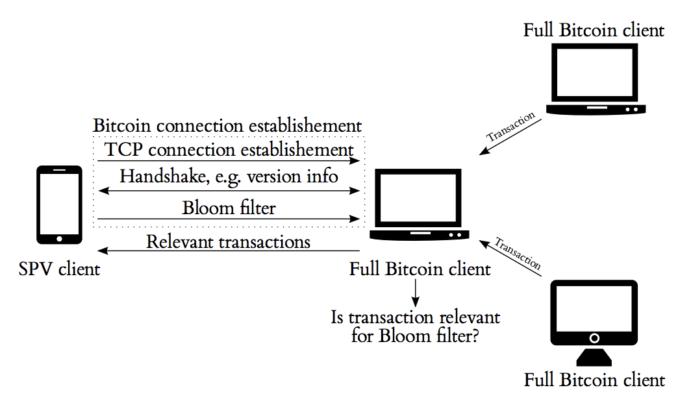

# Fraud Proofs - easier said than done?

## Background
The Bitcoin blockchain is, as of June 2018, approximately 173 Gigabytes in size [1]. This makes it nearly impossible for everyone to run a full Bitcoin node.
In the original Bitcoin whitepaper, Satoshi recognised this and introduced the concept of a Simplified Payment Verification (SPV) [2], in which he describes a technique that allows verification of payments using a lightweight client that doesn't need to download the entire Bitcoin blockchain, but rather by only downloading block headers with the longest proof-of-work chain [3]. 

Courtesy: Bitcoin: A Peer-to-Peer Electronic Cash System[2]

The full nodes would need to be able to alert SPV clients when an invalid block is detected [2].

An invalid block could be as a result of any of the following[6]:
* **Bad Txn** (invalid txn, doublespent txn, or repeat txn).
* **Missing block data** (the Merkle Tree “neighbors” of Sally’s txn are unknown and undiscoverable – this could be intentional or accidental).
* **Bad Block** (Other) (misplaced coinbase, wrong version, witness data missing, (drivechain) most updates to Escrow_DB/Withdrawal_DB)
* **Bad Accumulation** (the infamous blocksize/SigOps limits, the coinbase txn fees (which must balance total fees paid by the block’s txns), (drivechain) sidechain outputs – the “CTIP” field of “Escrow DB”)

# What are they?

Fraud proofs are a way to improve the security of SVP clients [5] by providing a mechanism for full nodes to prove that a chain is invalid irrespective of the amount of proof of work it has[5]. Fraud proofs could also help with the Bitcoin scaling debate as SPV clients are easier to run and could thus help with Bitcoin scalability issues[6].

A full Bitcoin node contains the following details:
  * every transaction that is currently being broadcast around the network
  * every transaction that has ever been sent
  * all the unspent transaction outputs (UTXOs) [4]
  
An SPV client such as a mobile device would not have the ability to process all that information and would need to check significantly less information than that. These SPV client make use of Bloom
filters to receive transactions that are relevant to their local wallet[7]. Bloom filters are probalistic data structures used to check the existence of an element in a set quicker by respond with a boolean answer[9]

Courtesy: On the Privacy Provisions of Bloom Filters in Lightweight
Bitcoin Clients [7]

In addition to Bloom filters, SPV cleints rely on Merkle trees - a binary structure that has a list of all the hashes between the block (apex) and the transaction (leaf). With merkle trees, one only needs to check a small part of the block, called a merkle root, to prove the transaction is in the block[8].

## Security and privacy issues with SPV clients
* **Security**

In August 2017, a weakness in the Bitcoin merkle tree design was found to reduce the security of SPV clients which could allow an attacker to simulate a payment of arbitrary amount to a victim using a SPV wallet, and trick the victim into accepting it as valid[10]. This brute force attack particularly affects systems that automatically accept SPV proofs and could be carried out with an investment of approximately $3 million[11]

* **Privacy**

## Suggested fraud proof improvements

## Conclusions, Observations, Recommendations

## References

[1] Size of the Bitcoin blockchain from 2010 to 2018, by quarter (in megabytes),https://www.statista.com/statistics/647523/worldwide-bitcoin-blockchain-size/, Date accessed: 2018-09-10.

[2] Bitcoin: A Peer-to-Peer Electronic Cash System, https://www.bitcoin.com/bitcoin.pdf, Date accessed: 2018-09-10.

[3] Simple Payment Verification, http://docs.electrum.org/en/latest/spv.html , Date accessed: 2018-09-10.

[4] SPV, Bloom filters and checkpoints, https://multibit.org/hd0.4/how-spv-works.html, Date accessed: 2018-09-10.

[5] Improving the ability of SPV clients to detect invalid chains
,https://gist.github.com/justusranvier/451616fa4697b5f25f60, Date accessed: 2018-09-10.

[6] Meditations on Fraud Proofs,http://www.truthcoin.info/blog/fraud-proofs/, Dated accessed: 2018-09-10.

[7] On the Privacy Provisions of Bloom Filters in Lightweight
Bitcoin Clients, https://eprint.iacr.org/2014/763.pdf, Date accessed: 2018-09-10.

[8]SPV, Bloom filters and checkpoints, https://multibit.org/hd0.4/how-spv-works.html, Date accessed: 2018-09-10.

[9] A Case of False Positives in Bloom Filters, https://medium.com/blockchain-musings/a-case-of-false-positives-in-bloom-filters-da09ec487ff0, Date accessed: 2018-09-11.

[10] The Design Of Bitcoin Merkle Trees Reduces The Security Of SPV Clients,https://media.rsk.co/the-design-of-bitcoin-merkle-trees-reduces-the-security-of-spv-clients/, Date accessed: 2018-09-11.

[11] Leaf-Node weakness in Bitcoin Merkle Tree Design, https://bitslog.wordpress.com/2018/06/09/leaf-node-weakness-in-bitcoin-merkle-tree-design/, Date accessed: 2018-09-11.

## Contributors

- [https://github.com/ksloven](https://github.com/ksloven)
